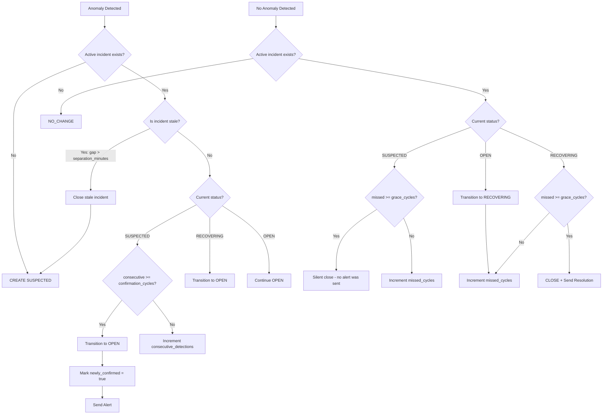

# Smartbox Anomaly Fingerprinting System

**Version**: 2.0 (Cycle-Based State Machine)
**Date**: December 2025
**Owner**: ML Platform Team

## Overview

The Anomaly Fingerprinting System provides stateful tracking and lifecycle management for anomalies detected by the Smartbox ML inference pipeline. It enables the observability service to track individual incidents over time, reducing noise from flapping alerts and providing rich historical context.

**Key Features in v2.0:**
- **Cycle-based confirmation**: Incidents require multiple consecutive detections before alerting
- **Grace period resolution**: Incidents don't close immediately when anomaly clears
- **Staleness detection**: Long time gaps create new incidents instead of continuing stale ones
- **Four-state lifecycle**: SUSPECTED → OPEN → RECOVERING → CLOSED

## Core Concepts

### Fingerprinting
Each anomaly is assigned a **stable, deterministic fingerprint ID** based on:
- Service name (e.g., `booking`)
- Anomaly name/type (e.g., `traffic_surge_failing`)

This ensures the same anomaly pattern gets the same fingerprint across inference runs and across different time-aware models.

### Incident vs Fingerprint
- **Fingerprint ID**: Content-based pattern identity (same pattern = same fingerprint)
- **Incident ID**: Unique occurrence identifier (each new incident = unique ID)

### Cycle-Based Lifecycle Management
Incidents follow a **state machine** designed to reduce alert noise:

```
                    ┌─────────────┐
     First detect   │  SUSPECTED  │  Waiting for confirmation
         ──────────►│  (no alert) │  (default: 2 cycles)
                    └──────┬──────┘
                           │ N consecutive detections
                           ▼
                    ┌─────────────┐
                    │    OPEN     │  CONFIRMED - alerts sent
                    │  (alerting) │◄──────────────────────────┐
                    └──────┬──────┘  detected again           │
                           │ 1-2 cycles not detected          │
                           ▼                                  │
                    ┌─────────────┐                           │
                    │ RECOVERING  │  Grace period             │
                    │  (waiting)  │───────────────────────────┘
                    └──────┬──────┘
                           │ N cycles not detected
                           │ OR time gap > separation threshold
                           ▼
                    ┌─────────────┐
                    │   CLOSED    │  Resolution sent
                    └─────────────┘
```

**States:**
1. **SUSPECTED** - First detection, waiting for confirmation (no alert yet)
2. **OPEN** - Confirmed incident, alerts are being sent
3. **RECOVERING** - Not detected recently, may resolve soon (no resolution yet)
4. **CLOSED** - Incident resolved, resolution notification sent

### State Persistence
All incident state is stored in SQLite for persistence across inference runs.

## System Architecture

```
┌─────────────────┐    ┌──────────────────┐    ┌─────────────────┐
│   Inference     │    │  Fingerprinting  │    │   Observability │
│   Pipeline      │────│     System       │────│     Service     │
│                 │    │                  │    │                 │
└─────────────────┘    └──────────────────┘    └─────────────────┘
         │                        │                        │
         │                        │                        │
         ▼                        ▼                        ▼
┌─────────────────┐    ┌──────────────────┐    ┌─────────────────┐
│ Rich Anomaly    │    │   SQLite State   │    │   Dashboard     │
│ Detection       │    │    Database      │    │   & Alerts      │
│ (Explainable)   │    │                  │    │                 │
└─────────────────┘    └──────────────────┘    └─────────────────┘
```

## Data Flow

### 1. Input Processing

**Input**: Raw anomaly detection result from ML pipeline
```json
{
  "service": "booking_night_hours",
  "anomalies": [{
    "type": "multivariate",
    "severity": "medium",
    "confidence_score": -0.009264,
    "description": "Unusual combination of metrics",
    "detection_method": "enhanced_isolation_forest"
  }],
  "current_metrics": {...},
  "metric_analysis": {...},
  "explanation": {...}
}
```

### 2. Service/Model Parsing

The full service name is parsed to extract components:
```python
"booking_night_hours" → service="booking", model="night_hours"
"fa5_evening_hours"   → service="fa5", model="evening_hours"  
"mobile-api_weekend_night" → service="mobile-api", model="weekend_night"
```

### 3. Anomaly ID Generation

Each anomaly gets a deterministic ID:
```python
content = f"{service_name}_{model_name}_{anomaly_name}"
hash_obj = hashlib.sha256(content.encode())
anomaly_id = f"anomaly_{hash_obj.hexdigest()[:12]}"
```

**Example:**
```
booking_night_hours_multivariate_enhanced_isolation_forest 
→ anomaly_7d20f5dbf0e4
```

### 4. State Comparison

The system checks the database for existing anomalies with the same ID:
- **Found**: UPDATE existing anomaly (increment count, update metrics)
- **Not Found**: CREATE new anomaly (add to database)

### 5. Output Enhancement

**Output**: Original payload enhanced with fingerprinting data
```json
{
  "service": "booking_night_hours",
  "anomalies": [{
    "type": "multivariate",
    "severity": "medium",
    "confidence_score": -0.009264,
    "description": "Unusual combination of metrics",
    "detection_method": "enhanced_isolation_forest",
    
    // 🆕 FINGERPRINTING ENHANCEMENTS
    "anomaly_id": "anomaly_7d20f5dbf0e4",
    "anomaly_name": "multivariate_enhanced_isolation_forest",
    "fingerprint_action": "CREATE",
    "occurrence_count": 1,
    "first_seen": "2025-08-19T22:21:57Z",
    "last_updated": "2025-08-19T22:21:57Z",
    "duration_minutes": 0
  }],
  
  // 🆕 FINGERPRINTING SUMMARY
  "fingerprinting": {
    "service_name": "booking",
    "model_name": "night_hours",
    "overall_action": "CREATE",
    "action_summary": {"creates": 1, "updates": 0, "resolves": 0},
    "resolved_anomalies": []
  },
  
  // ✅ PRESERVED ORIGINAL DATA
  "current_metrics": {...},
  "metric_analysis": {...},
  "explanation": {...}
}
```

## State Management

### Database Schema

**Table**: `anomaly_incidents` (v2.2_cycle_based)

| Column | Type | Description |
|--------|------|-------------|
| `fingerprint_id` | TEXT NOT NULL | Deterministic pattern ID (hash-based) |
| `incident_id` | TEXT PRIMARY KEY | Unique incident occurrence ID |
| `service_name` | TEXT NOT NULL | Service name (e.g., "booking") |
| `anomaly_name` | TEXT NOT NULL | Anomaly type name |
| `status` | TEXT NOT NULL | Current state: SUSPECTED, OPEN, RECOVERING, CLOSED |
| `severity` | TEXT NOT NULL | Current severity level |
| `first_seen` | TIMESTAMP NOT NULL | When incident was first detected |
| `last_updated` | TIMESTAMP NOT NULL | Last detection timestamp |
| `resolved_at` | TIMESTAMP NULL | When incident was resolved |
| `occurrence_count` | INTEGER NOT NULL | Total times detected during incident |
| `consecutive_detections` | INTEGER NOT NULL | Consecutive cycles detected (for confirmation) |
| `missed_cycles` | INTEGER NOT NULL | Consecutive cycles NOT detected (for grace period) |
| `current_value` | REAL | Current metric value |
| `threshold_value` | REAL | Threshold value if applicable |
| `confidence_score` | REAL | ML confidence score |
| `detection_method` | TEXT | Detection method used |
| `description` | TEXT | Human-readable description |
| `detected_by_model` | TEXT | Which time-period model detected it |
| `metadata` | TEXT | JSON metadata (includes resolution_reason) |

**Indexes**:
- `idx_fingerprint_status` on `(fingerprint_id, status)` for pattern lookups
- `idx_service_timeline` on `(service_name, first_seen DESC)` for service history
- `idx_incident_lookup` on `(incident_id)` for direct access
- `idx_active_incidents` on `(status, last_updated DESC)` WHERE status IN ('SUSPECTED', 'OPEN', 'RECOVERING')

### State Transitions



### Cycle-Based Transition Rules

| Current State | Event | Condition | New State | Action |
|---------------|-------|-----------|-----------|--------|
| (none) | Detected | - | SUSPECTED | Create incident, no alert |
| SUSPECTED | Detected | consecutive < N | SUSPECTED | Increment counter |
| SUSPECTED | Detected | consecutive >= N | OPEN | **Send alert** |
| SUSPECTED | Not detected | missed < N | SUSPECTED | Increment missed |
| SUSPECTED | Not detected | missed >= N | CLOSED | Silent close |
| OPEN | Detected | - | OPEN | Continue, reset missed |
| OPEN | Not detected | - | RECOVERING | Start grace period |
| RECOVERING | Detected | - | OPEN | Resume incident |
| RECOVERING | Not detected | missed < N | RECOVERING | Continue grace |
| RECOVERING | Not detected | missed >= N | CLOSED | **Send resolution** |
| Any | Detected | gap > separation_minutes | SUSPECTED | Close stale, create new |

**Default Configuration:**
- `confirmation_cycles = 2` (2 cycles ≈ 4-6 minutes to confirm)
- `resolution_grace_cycles = 3` (3 cycles ≈ 6-9 minutes grace period)
- `incident_separation_minutes = 30` (30+ minute gap = new incident)

### Lifecycle Examples

#### Example 1: New Incident (Cycle 1 - SUSPECTED)

**Cycle 1**: First detection - incident created in SUSPECTED state (no alert yet)
```json
{
  "fingerprint_action": "CREATE",
  "incident_action": "CREATE",
  "fingerprint_id": "anomaly_7d20f5dbf0e4",
  "incident_id": "incident_abc123def456",
  "status": "SUSPECTED",
  "occurrence_count": 1,
  "consecutive_detections": 1,
  "confirmation_pending": true,
  "cycles_to_confirm": 1,
  "first_seen": "2025-12-19T22:21:57Z"
}
```

**Database State**:
```sql
INSERT INTO anomaly_incidents VALUES (
  'anomaly_7d20f5dbf0e4',    -- fingerprint_id
  'incident_abc123def456',   -- incident_id
  'booking',                  -- service_name
  'traffic_surge_failing',    -- anomaly_name
  'SUSPECTED',                -- status (not OPEN yet!)
  'high',                     -- severity
  '2025-12-19T22:21:57Z',     -- first_seen
  '2025-12-19T22:21:57Z',     -- last_updated
  NULL,                       -- resolved_at
  1,                          -- occurrence_count
  1,                          -- consecutive_detections
  0,                          -- missed_cycles
  ...
);
```

#### Example 2: Confirmation (Cycle 2 - SUSPECTED → OPEN)

**Cycle 2**: Same anomaly detected again - incident CONFIRMED, now sends alert
```json
{
  "fingerprint_action": "UPDATE",
  "incident_action": "CONTINUE",
  "fingerprint_id": "anomaly_7d20f5dbf0e4",
  "incident_id": "incident_abc123def456",
  "status": "OPEN",
  "previous_status": "SUSPECTED",
  "occurrence_count": 2,
  "consecutive_detections": 2,
  "newly_confirmed": true,
  "is_confirmed": true,
  "first_seen": "2025-12-19T22:21:57Z",
  "last_updated": "2025-12-19T22:24:57Z",
  "incident_duration_minutes": 3
}
```

**Fingerprinting Summary**:
```json
{
  "overall_action": "CONFIRMED",
  "newly_confirmed_incidents": [{...}],
  "status_summary": {
    "suspected": 0,
    "confirmed": 1,
    "recovering": 0
  }
}
```

#### Example 3: Continuing OPEN Incident (Cycles 3-5)

**Cycles 3-5**: Anomaly persists, severity may change
```json
{
  "fingerprint_action": "UPDATE",
  "incident_action": "CONTINUE",
  "status": "OPEN",
  "occurrence_count": 5,
  "consecutive_detections": 5,
  "severity": "critical",
  "severity_changed": true,
  "previous_severity": "high",
  "incident_duration_minutes": 12
}
```

#### Example 4: Grace Period (Cycles 6-7 - OPEN → RECOVERING)

**Cycle 6**: Anomaly NOT detected - enters grace period
```json
{
  "fingerprinting": {
    "overall_action": "NO_CHANGE",
    "resolved_incidents": [],
    "status_summary": {
      "suspected": 0,
      "confirmed": 0,
      "recovering": 1
    }
  }
}
```

**Database State**: Status → RECOVERING, missed_cycles = 1

**Cycle 7**: Still not detected - grace period continues
- missed_cycles = 2, still RECOVERING

#### Example 5: Resolution (Cycle 8 - RECOVERING → CLOSED)

**Cycle 8**: Third cycle without detection - grace period exceeded, incident CLOSED
```json
{
  "fingerprinting": {
    "overall_action": "RESOLVE",
    "resolved_incidents": [{
      "fingerprint_id": "anomaly_7d20f5dbf0e4",
      "incident_id": "incident_abc123def456",
      "anomaly_name": "traffic_surge_failing",
      "fingerprint_action": "RESOLVE",
      "incident_action": "CLOSE",
      "final_severity": "critical",
      "resolved_at": "2025-12-19T22:45:57Z",
      "total_occurrences": 5,
      "incident_duration_minutes": 24,
      "missed_cycles_before_close": 3
    }]
  }
}
```

**Database State**:
```sql
UPDATE anomaly_incidents SET
  status = 'CLOSED',
  resolved_at = '2025-12-19T22:45:57Z',
  metadata = '{"resolution_reason": "resolved"}'
WHERE incident_id = 'incident_abc123def456';
```

#### Example 6: Stale Incident (Gap > 30 minutes)

**Scenario**: Anomaly detected at 10:00, not detected until 11:00 (60 min gap)

**At 11:00**: Old incident is auto-closed, new SUSPECTED incident created
```json
{
  "fingerprinting": {
    "overall_action": "CREATE",
    "action_summary": {
      "incident_creates": 1,
      "incident_closes": 1  // Stale incident auto-closed
    }
  },
  "anomalies": [{
    "fingerprint_id": "anomaly_7d20f5dbf0e4",  // Same pattern
    "incident_id": "incident_xyz789newone",    // NEW incident ID
    "status": "SUSPECTED",
    "occurrence_count": 1
  }]
}
```

**Log output**:
```
INFO - Auto-closed stale incident incident_abc123def456 (gap > 30min)
INFO - New suspected incident incident_xyz789newone (awaiting confirmation)
```

## Integration Points

### ML Inference Pipeline Integration

**Location**: `inference.py` - `main()` function

**Key Changes**:
```python
# Initialize fingerprinter
from anomaly_fingerprinter import AnomalyFingerprinter
fingerprinter = AnomalyFingerprinter(db_path="./anomaly_state.db")

# Process each inference result
for service_name, result in results.items():
    # Determine full service name with model
    full_service_name = f"{service_name}_{inferred_model_name}"
    
    # Apply fingerprinting
    enhanced_result = fingerprinter.process_anomalies(
        full_service_name=full_service_name,
        anomaly_result=result
    )
```

### Observability Service Integration

**Endpoint**: `POST /api/anomalies/batch`

**Enhanced Payload Structure**:
- ✅ **Preserved**: All existing explainability data
- 🆕 **Added**: Fingerprinting metadata
- 🆕 **Added**: Anomaly IDs and lifecycle info

### Time-Aware Model Integration

**Model Name Inference**:
```python
# Based on current time
current_hour = datetime.now().hour
if 8 <= current_hour < 18:
    model_name = 'business_hours'
elif 22 <= current_hour or current_hour < 6:
    model_name = 'night_hours'  
elif current_hour >= 18 and current_hour < 22:
    model_name = 'evening_hours'
# Weekend logic for weekend_day/weekend_night
```

## Configuration

### Command Line Options

```bash
python inference.py \
  --verbose \
  --enable-fingerprinting \        # Enable/disable (default: True)
  --fingerprint-db ./anomaly_state.db  # Database path
```

### Environment Variables

| Variable | Default | Description |
|----------|---------|-------------|
| `FINGERPRINT_DB_PATH` | `./anomaly_state.db` | SQLite database path |
| `FINGERPRINT_ENABLED` | `true` | Enable fingerprinting |

## API Reference

### AnomalyFingerprinter Class

#### Constructor
```python
AnomalyFingerprinter(db_path: str = "./anomaly_state.db")
```

#### Core Methods

**`process_anomalies()`**
```python
def process_anomalies(self, 
                     full_service_name: str,
                     anomaly_result: Dict,
                     current_metrics: Optional[Dict] = None,
                     timestamp: Optional[datetime] = None) -> Dict
```
- **Input**: Raw anomaly detection result
- **Output**: Enhanced result with fingerprinting
- **Side Effects**: Updates SQLite database

**`get_statistics()`**
```python
def get_statistics(self) -> Dict
```
Returns system statistics:
```json
{
  "total_active_anomalies": 15,
  "anomalies_by_service": [...],
  "anomalies_by_severity": {"medium": 8, "high": 7},
  "oldest_anomaly": {...}
}
```

#### Management Methods

**`get_service_anomalies()`**
```python
def get_service_anomalies(self, service_name: str, model_name: Optional[str] = None) -> List[Dict]
```

**`cleanup_old_anomalies()`**
```python
def cleanup_old_anomalies(self, max_age_hours: int = 72) -> int
```

## Monitoring & Operations

### Health Checks

**Database Connectivity**:
```python
try:
    stats = fingerprinter.get_statistics()
    print(f"✅ Active anomalies: {stats['total_active_anomalies']}")
except Exception as e:
    print(f"❌ Database error: {e}")
```

**Fingerprinting Status**:
```python
# Check for fingerprinting errors in logs
grep "Fingerprinting failed" inference.log
```

### Maintenance

**Database Cleanup**:
```python
# Remove anomalies older than 72 hours
deleted_count = fingerprinter.cleanup_old_anomalies(max_age_hours=72)
print(f"Cleaned up {deleted_count} old anomalies")
```

**Database Reset** (if corrupted):
```bash
rm ./anomaly_state.db
# Next inference run will recreate the database
```

### Performance Considerations

**Database Size Management**:
- Automatic cleanup of resolved anomalies
- Configurable retention period
- SQLite performance is adequate for expected volume (< 1000 active anomalies)

**Memory Usage**:
- Minimal memory footprint
- In-memory operations only during processing
- Thread-safe with locks for concurrent access

## Troubleshooting

### Common Issues

**Error**: `'anomaly'` KeyError
- **Cause**: Malformed anomaly data structure
- **Fix**: Check anomaly result format from ML pipeline

**Error**: `database is locked`
- **Cause**: Concurrent access to SQLite
- **Fix**: Implemented with thread locks, should auto-resolve

**Error**: Service name parsing failures
- **Cause**: Unexpected service name format
- **Fix**: Ensure service names follow `service_model` pattern

### Debug Mode

Add to `main()` function for debugging:
```python
if args.verbose:
    print(f"🔍 DEBUG {service_name}:")
    print(f"   Result keys: {list(result.keys())}")
    print(f"   Anomalies count: {len(result.get('anomalies', []))}")
```

### Log Analysis

**Key Log Patterns**:
```bash
# Successful operations
grep "Created new anomaly" inference.log
grep "Updated anomaly" inference.log  
grep "Resolved anomaly" inference.log

# Errors
grep "Fingerprinting failed" inference.log
grep "Database error" inference.log
```

## Future Enhancements

### Planned Features

1. **Advanced Correlation**: Group related anomalies across services
2. **Automatic Escalation**: Time-based severity escalation
3. **Pattern Detection**: Identify recurring anomaly patterns
4. **PostgreSQL Support**: For production scale deployments
5. **Metrics Export**: Prometheus metrics for monitoring

### Migration Path

**To PostgreSQL**:
1. Implement `PostgreSQLFingerprinter` class
2. Database schema migration scripts
3. Configuration flag to switch backends
4. Data migration utility

**To Redis** (for high-frequency deployments):
1. Implement `RedisFingerprinter` class  
2. TTL-based automatic cleanup
3. Pub/sub for real-time notifications

## Contact

**Team**: ML Platform Team  
**Slack**: #ml-platform  
**Repository**: `smartbox-ml-inference`  
**Documentation**: [Internal Wiki Link]

---

*This documentation covers the Anomaly Fingerprinting System v1.0. For questions or issues, please contact the ML Platform team.*
