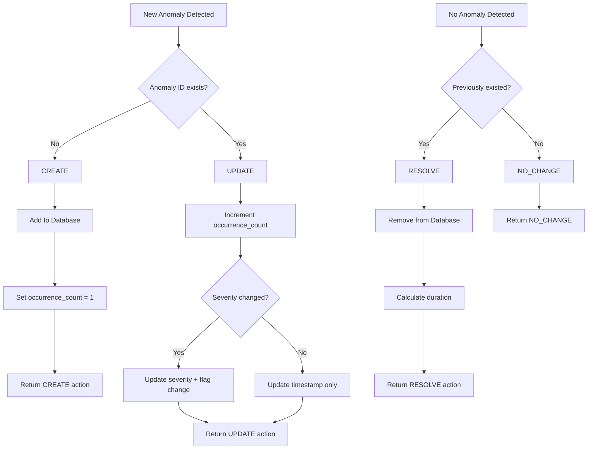

# Smartbox Anomaly Fingerprinting System

**Version**: 1.0  
**Date**: August 2025  
**Owner**: ML Platform Team  

## Overview

The Anomaly Fingerprinting System provides stateful tracking and lifecycle management for anomalies detected by the Smartbox ML inference pipeline. It enables the observability service to track individual anomalies over time, reducing noise and providing rich historical context.

## Core Concepts

### Fingerprinting
Each anomaly is assigned a **stable, deterministic ID** based on:
- Service name (e.g., `booking`)
- Model name (e.g., `night_hours`) 
- Anomaly type (e.g., `multivariate_enhanced_isolation_forest`)

This ensures the same anomaly gets the same ID across inference runs.

### Lifecycle Management
Anomalies follow a clear lifecycle:
1. **CREATE** - First detection of a new anomaly pattern
2. **UPDATE** - Subsequent detections of the same anomaly
3. **RESOLVE** - Anomaly no longer detected (auto-resolution)

### State Persistence
All anomaly state is stored in SQLite for persistence across inference runs.

## System Architecture

```
┌─────────────────┐    ┌──────────────────┐    ┌─────────────────┐
│   Inference     │    │  Fingerprinting  │    │   Observability │
│   Pipeline      │────│     System       │────│     Service     │
│                 │    │                  │    │                 │
└─────────────────┘    └──────────────────┘    └─────────────────┘
         │                        │                        │
         │                        │                        │
         ▼                        ▼                        ▼
┌─────────────────┐    ┌──────────────────┐    ┌─────────────────┐
│ Rich Anomaly    │    │   SQLite State   │    │   Dashboard     │
│ Detection       │    │    Database      │    │   & Alerts      │
│ (Explainable)   │    │                  │    │                 │
└─────────────────┘    └──────────────────┘    └─────────────────┘
```

## Data Flow

### 1. Input Processing

**Input**: Raw anomaly detection result from ML pipeline
```json
{
  "service": "booking_night_hours",
  "anomalies": [{
    "type": "multivariate",
    "severity": "medium",
    "confidence_score": -0.009264,
    "description": "Unusual combination of metrics",
    "detection_method": "enhanced_isolation_forest"
  }],
  "current_metrics": {...},
  "metric_analysis": {...},
  "explanation": {...}
}
```

### 2. Service/Model Parsing

The full service name is parsed to extract components:
```python
"booking_night_hours" → service="booking", model="night_hours"
"fa5_evening_hours"   → service="fa5", model="evening_hours"  
"mobile-api_weekend_night" → service="mobile-api", model="weekend_night"
```

### 3. Anomaly ID Generation

Each anomaly gets a deterministic ID:
```python
content = f"{service_name}_{model_name}_{anomaly_name}"
hash_obj = hashlib.sha256(content.encode())
anomaly_id = f"anomaly_{hash_obj.hexdigest()[:12]}"
```

**Example:**
```
booking_night_hours_multivariate_enhanced_isolation_forest 
→ anomaly_7d20f5dbf0e4
```

### 4. State Comparison

The system checks the database for existing anomalies with the same ID:
- **Found**: UPDATE existing anomaly (increment count, update metrics)
- **Not Found**: CREATE new anomaly (add to database)

### 5. Output Enhancement

**Output**: Original payload enhanced with fingerprinting data
```json
{
  "service": "booking_night_hours",
  "anomalies": [{
    "type": "multivariate",
    "severity": "medium",
    "confidence_score": -0.009264,
    "description": "Unusual combination of metrics",
    "detection_method": "enhanced_isolation_forest",
    
    // 🆕 FINGERPRINTING ENHANCEMENTS
    "anomaly_id": "anomaly_7d20f5dbf0e4",
    "anomaly_name": "multivariate_enhanced_isolation_forest",
    "fingerprint_action": "CREATE",
    "occurrence_count": 1,
    "first_seen": "2025-08-19T22:21:57Z",
    "last_updated": "2025-08-19T22:21:57Z",
    "duration_minutes": 0
  }],
  
  // 🆕 FINGERPRINTING SUMMARY
  "fingerprinting": {
    "service_name": "booking",
    "model_name": "night_hours",
    "overall_action": "CREATE",
    "action_summary": {"creates": 1, "updates": 0, "resolves": 0},
    "resolved_anomalies": []
  },
  
  // ✅ PRESERVED ORIGINAL DATA
  "current_metrics": {...},
  "metric_analysis": {...},
  "explanation": {...}
}
```

## State Management

### Database Schema

**Table**: `anomaly_state`

| Column | Type | Description |
|--------|------|-------------|
| `id` | TEXT PRIMARY KEY | Unique anomaly ID (hash-based) |
| `service_name` | TEXT NOT NULL | Service name (e.g., "booking") |
| `model_name` | TEXT NOT NULL | Model name (e.g., "night_hours") |
| `anomaly_name` | TEXT NOT NULL | Anomaly type name |
| `severity` | TEXT NOT NULL | Current severity level |
| `first_seen` | TIMESTAMP NOT NULL | When anomaly was first detected |
| `last_updated` | TIMESTAMP NOT NULL | Last update timestamp |
| `occurrence_count` | INTEGER NOT NULL | Number of times detected |
| `current_value` | REAL | Current metric value |
| `threshold_value` | REAL | Threshold value if applicable |
| `confidence_score` | REAL | ML confidence score |
| `detection_method` | TEXT | Detection method used |
| `description` | TEXT | Human-readable description |
| `metadata` | TEXT | JSON metadata |

**Indexes**:
- `idx_service_model` on `(service_name, model_name)` for fast lookups

### State Transitions



### Lifecycle Examples

#### Example 1: New Anomaly

**Run 1**: First detection
```json
{
  "fingerprint_action": "CREATE",
  "anomaly_id": "anomaly_7d20f5dbf0e4",
  "occurrence_count": 1,
  "first_seen": "2025-08-19T22:21:57Z",
  "duration_minutes": 0
}
```

**Database State**:
```sql
INSERT INTO anomaly_state VALUES (
  'anomaly_7d20f5dbf0e4',
  'booking', 
  'night_hours',
  'multivariate_enhanced_isolation_forest',
  'medium',
  '2025-08-19T22:21:57Z',
  '2025-08-19T22:21:57Z',
  1,
  ...
);
```

#### Example 2: Persisting Anomaly

**Run 2**: Same anomaly detected (5 minutes later)
```json
{
  "fingerprint_action": "UPDATE", 
  "anomaly_id": "anomaly_7d20f5dbf0e4",
  "occurrence_count": 2,
  "first_seen": "2025-08-19T22:21:57Z",
  "last_updated": "2025-08-19T22:26:57Z",
  "duration_minutes": 5
}
```

**Database State**:
```sql
UPDATE anomaly_state SET 
  last_updated = '2025-08-19T22:26:57Z',
  occurrence_count = 2
WHERE id = 'anomaly_7d20f5dbf0e4';
```

#### Example 3: Severity Escalation

**Run 3**: Severity increases (10 minutes later)
```json
{
  "fingerprint_action": "UPDATE",
  "anomaly_id": "anomaly_7d20f5dbf0e4", 
  "occurrence_count": 3,
  "severity": "high",
  "severity_changed": true,
  "previous_severity": "medium",
  "severity_changed_at": "2025-08-19T22:31:57Z",
  "duration_minutes": 10
}
```

#### Example 4: Resolution

**Run 4**: Anomaly no longer detected (15 minutes later)
```json
{
  "fingerprinting": {
    "overall_action": "RESOLVE",
    "resolved_anomalies": [{
      "anomaly_id": "anomaly_7d20f5dbf0e4",
      "fingerprint_action": "RESOLVE",
      "final_severity": "high", 
      "resolved_at": "2025-08-19T22:36:57Z",
      "total_occurrences": 3,
      "duration_minutes": 15
    }]
  }
}
```

**Database State**:
```sql
DELETE FROM anomaly_state WHERE id = 'anomaly_7d20f5dbf0e4';
```

## Integration Points

### ML Inference Pipeline Integration

**Location**: `inference.py` - `main()` function

**Key Changes**:
```python
# Initialize fingerprinter
from anomaly_fingerprinter import AnomalyFingerprinter
fingerprinter = AnomalyFingerprinter(db_path="./anomaly_state.db")

# Process each inference result
for service_name, result in results.items():
    # Determine full service name with model
    full_service_name = f"{service_name}_{inferred_model_name}"
    
    # Apply fingerprinting
    enhanced_result = fingerprinter.process_anomalies(
        full_service_name=full_service_name,
        anomaly_result=result
    )
```

### Observability Service Integration

**Endpoint**: `POST /api/anomalies/batch`

**Enhanced Payload Structure**:
- ✅ **Preserved**: All existing explainability data
- 🆕 **Added**: Fingerprinting metadata
- 🆕 **Added**: Anomaly IDs and lifecycle info

### Time-Aware Model Integration

**Model Name Inference**:
```python
# Based on current time
current_hour = datetime.now().hour
if 8 <= current_hour < 18:
    model_name = 'business_hours'
elif 22 <= current_hour or current_hour < 6:
    model_name = 'night_hours'  
elif current_hour >= 18 and current_hour < 22:
    model_name = 'evening_hours'
# Weekend logic for weekend_day/weekend_night
```

## Configuration

### Command Line Options

```bash
python inference.py \
  --verbose \
  --enable-fingerprinting \        # Enable/disable (default: True)
  --fingerprint-db ./anomaly_state.db  # Database path
```

### Environment Variables

| Variable | Default | Description |
|----------|---------|-------------|
| `FINGERPRINT_DB_PATH` | `./anomaly_state.db` | SQLite database path |
| `FINGERPRINT_ENABLED` | `true` | Enable fingerprinting |

## API Reference

### AnomalyFingerprinter Class

#### Constructor
```python
AnomalyFingerprinter(db_path: str = "./anomaly_state.db")
```

#### Core Methods

**`process_anomalies()`**
```python
def process_anomalies(self, 
                     full_service_name: str,
                     anomaly_result: Dict,
                     current_metrics: Optional[Dict] = None,
                     timestamp: Optional[datetime] = None) -> Dict
```
- **Input**: Raw anomaly detection result
- **Output**: Enhanced result with fingerprinting
- **Side Effects**: Updates SQLite database

**`get_statistics()`**
```python
def get_statistics(self) -> Dict
```
Returns system statistics:
```json
{
  "total_active_anomalies": 15,
  "anomalies_by_service": [...],
  "anomalies_by_severity": {"medium": 8, "high": 7},
  "oldest_anomaly": {...}
}
```

#### Management Methods

**`get_service_anomalies()`**
```python
def get_service_anomalies(self, service_name: str, model_name: Optional[str] = None) -> List[Dict]
```

**`cleanup_old_anomalies()`**
```python
def cleanup_old_anomalies(self, max_age_hours: int = 72) -> int
```

## Monitoring & Operations

### Health Checks

**Database Connectivity**:
```python
try:
    stats = fingerprinter.get_statistics()
    print(f"✅ Active anomalies: {stats['total_active_anomalies']}")
except Exception as e:
    print(f"❌ Database error: {e}")
```

**Fingerprinting Status**:
```python
# Check for fingerprinting errors in logs
grep "Fingerprinting failed" inference.log
```

### Maintenance

**Database Cleanup**:
```python
# Remove anomalies older than 72 hours
deleted_count = fingerprinter.cleanup_old_anomalies(max_age_hours=72)
print(f"Cleaned up {deleted_count} old anomalies")
```

**Database Reset** (if corrupted):
```bash
rm ./anomaly_state.db
# Next inference run will recreate the database
```

### Performance Considerations

**Database Size Management**:
- Automatic cleanup of resolved anomalies
- Configurable retention period
- SQLite performance is adequate for expected volume (< 1000 active anomalies)

**Memory Usage**:
- Minimal memory footprint
- In-memory operations only during processing
- Thread-safe with locks for concurrent access

## Troubleshooting

### Common Issues

**Error**: `'anomaly'` KeyError
- **Cause**: Malformed anomaly data structure
- **Fix**: Check anomaly result format from ML pipeline

**Error**: `database is locked`
- **Cause**: Concurrent access to SQLite
- **Fix**: Implemented with thread locks, should auto-resolve

**Error**: Service name parsing failures
- **Cause**: Unexpected service name format
- **Fix**: Ensure service names follow `service_model` pattern

### Debug Mode

Add to `main()` function for debugging:
```python
if args.verbose:
    print(f"🔍 DEBUG {service_name}:")
    print(f"   Result keys: {list(result.keys())}")
    print(f"   Anomalies count: {len(result.get('anomalies', []))}")
```

### Log Analysis

**Key Log Patterns**:
```bash
# Successful operations
grep "Created new anomaly" inference.log
grep "Updated anomaly" inference.log  
grep "Resolved anomaly" inference.log

# Errors
grep "Fingerprinting failed" inference.log
grep "Database error" inference.log
```

## Future Enhancements

### Planned Features

1. **Advanced Correlation**: Group related anomalies across services
2. **Automatic Escalation**: Time-based severity escalation
3. **Pattern Detection**: Identify recurring anomaly patterns
4. **PostgreSQL Support**: For production scale deployments
5. **Metrics Export**: Prometheus metrics for monitoring

### Migration Path

**To PostgreSQL**:
1. Implement `PostgreSQLFingerprinter` class
2. Database schema migration scripts
3. Configuration flag to switch backends
4. Data migration utility

**To Redis** (for high-frequency deployments):
1. Implement `RedisFingerprinter` class  
2. TTL-based automatic cleanup
3. Pub/sub for real-time notifications

## Contact

**Team**: ML Platform Team  
**Slack**: #ml-platform  
**Repository**: `smartbox-ml-inference`  
**Documentation**: [Internal Wiki Link]

---

*This documentation covers the Anomaly Fingerprinting System v1.0. For questions or issues, please contact the ML Platform team.*
